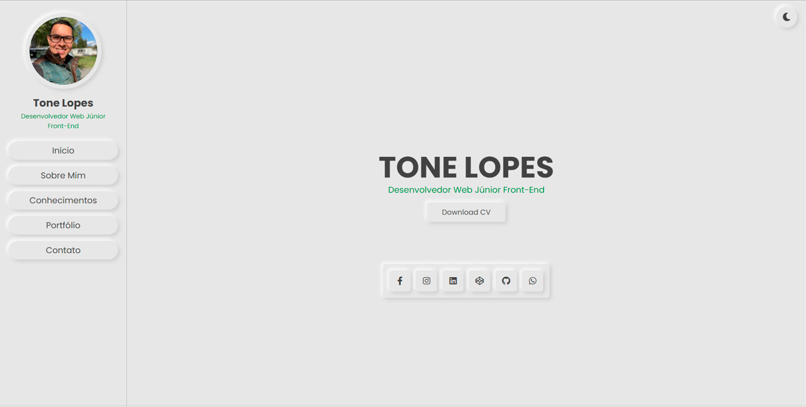
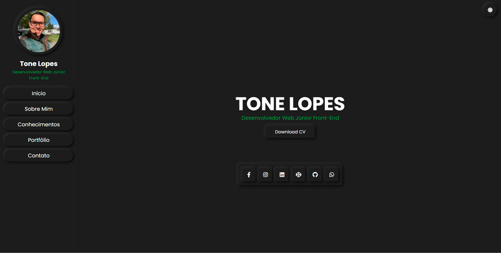

# Meu Portfólio

Bem-vindo ao meu site pessoal de desenvolvimento web! Aqui, você encontrará uma seleção de projetos de front-end que desenvolvi utilizando algumas das tecnologias mais recentes e avançadas, tais como HTML, CSS, JavaScript, jQuery, ReactJS e Bootstrap.

Minha abordagem em cada projeto é focada em criar interfaces de usuário responsivas, intuitivas e agradáveis, com atenção aos detalhes em cada aspecto do design. Além disso, utilizo o Git para versionamento de código, o que me permite colaborar eficientemente com outros desenvolvedores e garantir que o projeto evolua de forma segura e organizada.

Com uma grande paixão pela criação de soluções web personalizadas e funcionais, sempre busco entender as necessidades de cada cliente e suas expectativas para criar uma solução única e que realmente faça a diferença para seus negócios. Com habilidades tanto em front-end como back-end, posso oferecer soluções web completas para as necessidades específicas do seu projeto.

Fique à vontade para navegar pelo meu portfólio de projetos e entrar em contato comigo caso esteja interessado em colaborar em um projeto. Estou ansioso para ouvir sobre suas ideias e como posso ajudar a transformá-las em realidade!

### TECNOLOGIAS USADAS
> HTML,
> CSS E 
> JAVASCRIPT

### TELAS 

